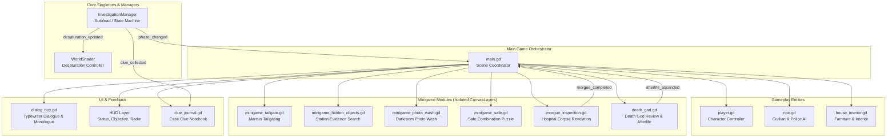

# 🏛️ ARSITEKTUR PERANGKAT LUNAK (ARCHITECTURE)
## Game: *Kasus Terakhir Benedict* (Godot 4.x)

Dokumen ini menjelaskan rancangan arsitektur, pemisahan tanggung jawab (*Separation of Concerns*), dan pola desain (*Design Patterns*) yang digunakan agar proyek ini mudah dikembangkan, diuji, dan dikelola bersama tim pengembang (*multi-developer team*).

---

## 1. Ikhtisar Arsitektur Tingkat Tinggi

Proyek ini dibangun menggunakan **Godot 4.x** dengan pendekatan berbasis komponen (*Component-Based Architecture*) dan pola **Event Bus / Signal Driven**.



---

## 2. Pola Desain Utama (Design Patterns)

### A. State Machine Fase Investigasi (`InvestigationManager`)
Alur cerita dikontrol oleh sebuah State Machine terpusat di `scripts/investigation_manager.gd`:
```gdscript
enum Phase {
    PROLOGUE_HOME = 0,          # Eksplorasi jalan & rumah korban
    INVESTIGATION_1_POLICE = 1, # Kuntit Inspektur Marcus
    INVESTIGATION_2_STATION = 2,# Cari bukti peron stasiun
    INVESTIGATION_3_PHOTO = 3,  # Cuci foto di kamar gelap
    INVESTIGATION_4_HOSPITAL = 4,# Kamar mayat rumah sakit
    FINAL_DEATH_GOD = 5         # Pengadilan Dewa Kematian
}
```
Setiap perubahan fase memancarkan sinyal `phase_changed(new_phase, title)`, yang secara otomatis:
1. Memperbarui kartu target HUD pemain.
2. Menghitung tingkat desaturasi warna dunia (*visual desaturation* menuju kematian arwah).
3. Menampilkan notifikasi visual toast di layar.

### B. Minigame Modular (Isolated CanvasLayers)
Setiap minigame (`minigame_tailgate.gd`, `minigame_photo_wash.gd`, `minigame_safe.gd`, `morgue_inspection.gd`) diimplementasikan sebagai `CanvasLayer` independen:
- **Kemandirian**: Tidak bergantung pada node spesifik di scene utama; minigame dapat diuji coba secara terisolasi via skrip runner.
- **Sinyal Selesai**: Memancarkan sinyal `minigame_completed(success)` saat tuntas.
- **Input Isolation**: Menggunakan `_unhandled_input` atau input modal agar kontrol pemain di dunia luar otomatis dijeda saat minigame aktif.

### C. Sistem Dialog & Monolog (`dialog_box.gd`)
Komponen dialog mendukung:
1. **Mode Percakapan Dua Arah**: Interaksi NPC dengan dialog interaktif.
2. **Mode Monolog Batin**: `start_monologue(lines, speaker, title, portrait_path)`.
3. **Efek Ketikan (Typewriter)**: Menggunakan audio SFX `sound/keyboardtype.mp3` dengan kecepatan ketik adaptif.
4. **Potret Karakter Dinamis**: Otomatis mendeteksi dan menampilkan ekspresi Benedict (`MC_Biasa.png`, `MC_Bingung.png`, `MC_Kaget.png`, `MC_Sedih.png`) dan Dewa Kematian (`grim.png`).

---

## 3. Struktur Direktori Proyek

```
game ipb/
├── scenes/                 # File Scene (.tscn)
│   ├── main.tscn           # Scene Utama Dunia Kota
│   ├── dialog_box.tscn     # Scene Dialog Box
│   └── opening_cutscene.tscn# Scene Cutscene Pembuka
├── scripts/                # File Logika Pemrograman (.gd)
│   ├── main.gd             # Orkestrator Game Utama
│   ├── player.gd           # Kontroler Pemain (WASD, Sprint, Zoom)
│   ├── npc.gd              # Karakter NPC Kota & Inspektur Marcus
│   ├── investigation_manager.gd # State Machine Kasus & Jurnal Bukti
│   ├── morgue_inspection.gd # Sistem Kamar Jenazah
│   ├── death_god.gd        # Kuis Dewa Kematian & Afterlife
│   ├── minigame_tailgate.gd# Minigame Menguntit
│   ├── minigame_photo_wash.gd# Minigame Cuci Foto
│   ├── minigame_safe.gd    # Minigame Kode Brankas
│   └── ...
├── sound/                  # Audio, Musik BGM, dan Efek Suara (.mp3, .wav)
├── karakter/               # Potret Resolusi Tinggi Karakter
├── UI/                     # Aset Antarmuka, Potret, & Polaroid
├── Environment/            # Sprite Lingkungan, Gedung, Jalan, & Perabot
├── data/                   # Konfigurasi JSON & Dokumen Game
├── docs/                   # Dokumentasi Tim (GDD, Arsitektur, Kontribusi)
└── ai_server/              # Backend Layanan AI NLP (FastAPI + Transformers)
```

---

## 4. Konvensi Sinyal & Event Bus
Untuk mencegah keterikatan langsung (*tight coupling*):
- Node anak **TIDAK BOLEH** memanggil method milik node induk secara hard-coded (`get_parent().do_something()`).
- Node anak **HARUS** memancarkan sinyal (`signal_name.emit(...)`), dan node pengatur (seperti `main.gd`) yang menyambungkannya (`child.signal_name.connect(...)`).
- Gunakan `Callable` dan `CONNECT_ONE_SHOT` bila penanganan sinyal hanya dibutuhkan sekali (misal transisi monolog ke closeup).
