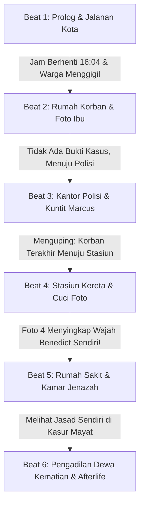

# 📖 GAME DESIGN DOCUMENT (GDD)
## *Kasus Terakhir Benedict: Detektif & Sang Dewa Kematian*

---

## 1. Sinopsis & Premis Utama
**Detektif Benedict** terbangun dan menyusuri jalanan kota berkabut menuju rumah seorang korban pembunuhan misterius. Di sepanjang jalan, kejanggalan demi kejanggalan mulai tampak: jam kota membeku di **16:04**, dan setiap warga yang ia sapa justru menggigil ketakutan dengan bulu kuduk merinding tanpa menyahut sapaannya.

Penyelidikan membawanya dari rumah korban yang hampa tanpa jejak kejahatan, kantor polisi tempat ia menguntit Inspektur Marcus, stasiun kereta api tempat ditemukannya rol film korban, hingga kamar gelap tempat foto korban dicuci. Saat lembar foto terakhir menampakkan wajah dirinya sendiri, Benedict menolak percaya dan menyelinap ke kamar mayat rumah sakit.

Di sanalah kenyataan mutlak tersingkap: jasad kaku di atas ranjang dorong adalah raganya sendiri yang telah tiada. Benedict tidak sedang menyelidiki kematian orang lain—ia adalah arwah yang mencari kebenaran tentang ajalnya sendiri. Di hadapan Sang Dewa Kematian, jiwanya diuji untuk mengikhlaskan takdir dan melangkah menuju kedamaian abadi (*Afterlife*).

---

## 2. Alur Cerita (6 Story Beats)

### Beat 1: Prolog & Jalanan Kota (The Stopped Clock & Cold Encounters)
- **Lokasi**: Trotoar Jalan Utama Kota (X: 100..600, Y: 220..260).
- **Peristiwa**:
  - Benedict mengamati jam jalan kota yang jarumnya membeku tepat di pukul **16:04**.
  - Benedict menyapa warga sipil yang berlalu-lalang. Warga tidak menjawab dan justru merinding kedinginan (*"Hii... kenapa tiba-tiba dingin banget ya? Bulu kudukku merinding..."*).
- **Bukti Terbuka**: `street_clock_freeze` (Jam Kota Membeku 16:04).
- **Visual/Audio**: Suasana redup, langkah kaki, potret monolog `MC_Bingung.png`.

### Beat 2: Rumah Korban (The Empty House & Mother's Photo)
- **Lokasi**: Interior Rumah (X: 1170, Y: 230).
- **Peristiwa**:
  - Benedict masuk dan memeriksa seisi ruangan.
  - Tidak ada berkas kasus pembunuhan sama sekali. Yang ditemukan hanyalah sebuah foto polaroid berdebu seorang ibu dan anaknya (`res://UI/Polaroid/polaroidIbu.png`).
  - Di balik foto terdapat catatan tangan: *"Untuk anakku tercinta... Kembalilah ke rumah Ibu jika sempat. Ibu menyimpan sesuatu untukmu di brankas keluarga. Kuncinya: waktu yang membeku (1-6-4)"*.
  - Menemukan foto ini membuka **Misi Opsional**: Rumah Ibu & Brankas Keluarga.
  - Karena rumah korban buntu, Benedict memutuskan mencari Inspektur Marcus di Kantor Polisi.
- **Bukti Terbuka**: `mother_photo_riddle`.
- **Target Baru**: `INVESTIGATION_1_POLICE`.

### Beat 3: Kantor Polisi & Menguntit Marcus (The Tailgate)
- **Lokasi**: Kantor Polisi Barat (X: 280, Y: 915).
- **Peristiwa**:
  - Inspektur Marcus sedang terburu-buru keluar mengurus kasus yang sama dan menolak diajak bicara formal.
  - Benedict memutuskan menguntit Marcus dari jarak aman.
  - **Minigame Menguntit**: Pemain mengendalikan Benedict dengan WASD untuk menjaga jarak aman (100–260 piksel) tanpa terdeteksi.
  - Audio latar: `sound/TALKING (Bg).mp3`.
  - Percakapan radio Marcus yang terdengar: *"Korban terakhir kali terlihat tergesa-gesa menuju Stasiun Kereta Api Timur untuk liburan ke luar kota..."*
- **Bukti Terbuka**: `police_eavesdrop`.
- **Target Baru**: `INVESTIGATION_2_STATION`.

### Beat 4: Stasiun Kereta Api & Kamar Gelap (The Train & The Darkroom Revelation)
- **Lokasi**: Stasiun Kereta Api Timur (X: 2020, Y: 930) & Bak Cuci Foto Rumah.
- **Peristiwa**:
  - Di peron stasiun, pemain memainkan **Minigame Hidden Objects** dan menemukan Tiket Kereta Api Terakhir serta Amplop Rol Film Foto korban.
  - Benedict membawa rol film ke bak cairan kamar gelap:
    - **Langkah 1**: Menahan klik/spasi untuk merendam foto dalam cairan pengembang.
    - **Langkah 2**: Membilas foto dengan quick-time event (QTE) keyboard.
    - **Langkah 3**: Foto ke-4 selesai dicuci. Di bawah lampu merah, detail foto korban terlihat jelas: kemeja putih, dasi detektif, dan wajah korban adalah **WAJAH BENEDICT SENDIRI**!
  - Audio: `sound/Suspense.mp3` diputar secara dramatis. Benedict terkejut luar biasa (`MC_Kaget.png`) dan memutuskan mencari konfirmasi ke Rumah Sakit.
- **Bukti Terbuka**: `train_ticket`, `photo_envelope`, `developed_photos`.
- **Target Baru**: `INVESTIGATION_4_HOSPITAL`.

### Beat 5: Rumah Sakit & Kamar Jenazah (The Morgue Discovery)
- **Lokasi**: Rumah Sakit Kota (X: 750, Y: 1095).
- **Peristiwa**:
  - Resepsionis menolak memberikan berkas autopsi resmi karena belum ditandatangani, dan dokter forensik tidak bisa dihubungi.
  - Benedict menyelinap ke lorong bawah tanah menuju **Kamar Jenazah**.
  - Audio: Suara steril dan mencekam `sound/HOSPITAL.mp3`.
  - Di dalam kamar mayat, tampak ranjang dorong berisi tubuh tertutup kain putih (`res://Environment/Ruang Mayat/kasurmayat.png`).
  - Benedict menyingkap kain penutup: tubuh kaku di atas ranjang adalah dirinya sendiri (`res://Environment/Ruang Mayat/kasurmayat-mayat.png`).
  - Audio: `sound/FLASHBACK.mp3` dan nafas berat `sound/Heavy Breathing.mp3`.
  - Monolog pengakuan (`MC_Kaget.png` -> `MC_Sedih.png`): *"Aku bukan sedang menyelidiki kematian orang lain... Aku sudah mati sejak awal..."*
- **Bukti Terbuka**: `autopsy_corpse`.
- **Target Baru**: `FINAL_DEATH_GOD`.

### Beat 6: Pengadilan Dewa Kematian & Afterlife (The Final Judgement)
- **Peristiwa**:
  - Benedict secara supranatural ditarik (*ketarik*) ke dimensi Dewa Kematian.
  - Transisi musik halus menuju `sound/Afterlife.mp3`.
  - Sang Dewa Kematian (`res://karakter/grim.png`) menampakkan wujudnya dan menguji pemahaman jiwa Benedict:
    1. *Jam berapa jarum waktu kota membeku saat nafasmu berhenti?* -> **16:04**.
    2. *Mengapa orang-orang di jalanan bergidik dingin saat kamu sapa?* -> **Karena aku adalah arwah tak kasat mata**.
    3. *Siapakah korban sebenarnya di foto peron dan kamar jenazah?* -> **Diriku sendiri (Benedict)**.
    4. *Bagaimana perasaanmu sekarang terhadap takdir kematianmu?* -> **Aku ikhlas menerima kematianku dan siap beristirahat dalam damai**.
  - Benedict mencapai rekonsiliasi batin, berdamai dengan kematiannya, dan melangkah ke alam berikutnya dalam damai.
  - Layar penutup: *Ascension to Afterlife* dengan kartu penyelesaian kasus.

---

## 3. Misi Opsional: Rumah Ibu & Brankas Keluarga
- **Pemicu**: Menemukan foto polaroid ibu dan anak di rumah korban.
- **Lokasi**: Rumah Ibu di sudut kota.
- **Petunjuk Kode Brankas**:
  - Catatan foto: Waktu membeku (1-6-4).
  - Buku Resep Ibu (`BUKU RESEP.png`).
  - Jam weker meja (`jam weker.png`).
  - Kalender dinding bertanggal penting (`kalender.png`).
- **Solusi**: Kombinasi `1 - 6 - 4`.
- **Hadiah**: `mother_emotional_locket` (Liontin Kasih Sayang Ibu Medeline). Membuka dialog emosional tambahan bersama Dewa Kematian untuk *True Afterlife Ending*.

---

## 4. Daftar Aset Suara & Mapping Cerita
| File Audio | Peruntukan / Adegan |
|---|---|
| `sound/BGM.mp3` | Musik latar eksplorasi jalanan & penyelidikan kota |
| `sound/Afterlife.mp3` | Pertemuan dengan Dewa Kematian & akhir perjalanan arwah |
| `sound/HOSPITAL.mp3` | Suasana lorong dan kamar jenazah rumah sakit |
| `sound/FLASHBACK.mp3` | Momen kilas balik saat kain mayat disingkap |
| `sound/Suspense.mp3` | Momen terkejut saat foto wajah Benedict di baskom terungkap |
| `sound/TALKING (Bg).mp3` | Suara obrolan dan radio saat menguntit Marcus |
| `sound/Heavy Breathing.mp3` | Hembusan nafas berat saat realitas kematian tersadar |
| `sound/Paper.mp3` | Membuka foto polaroid ibu & catatan tangan |
| `sound/Click sound.mp3` | Interaksi tombol UI dan putaran dial brankas |
| `sound/Door Open.mp3` | Suara buka pintu rumah, mobil, dan brankas baja |
| `sound/keyboardtype.mp3` | Efek ketikan teks dialog & cutscene pembuka |
| `sound/Water Splash.mp3` | Celupan foto polaroid di baskom cairan kimia |
